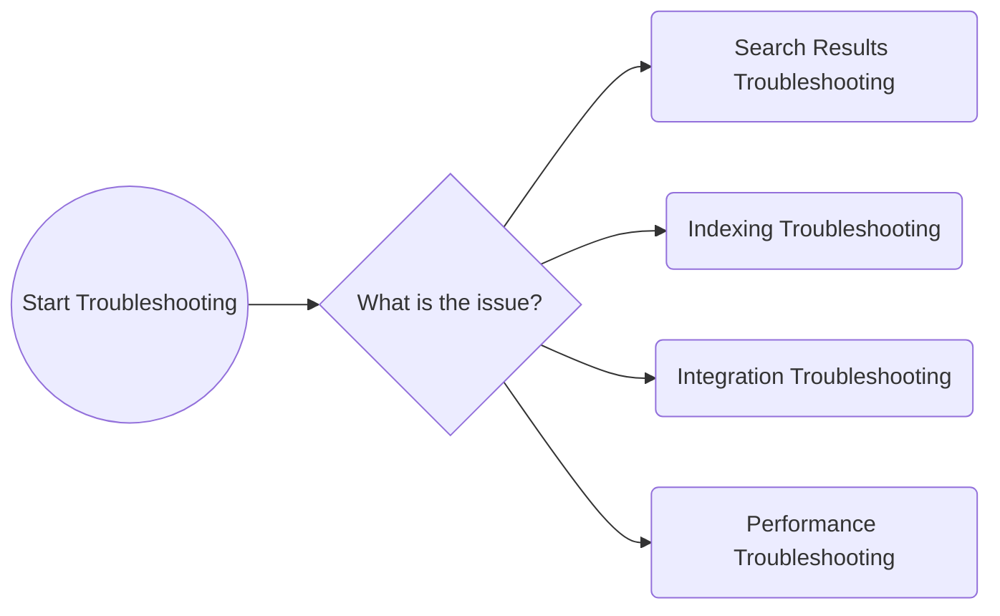
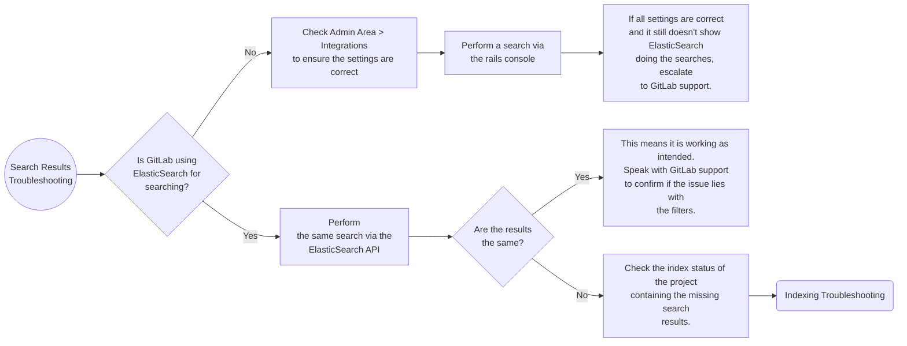
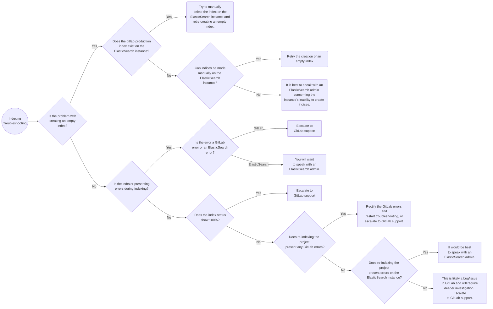
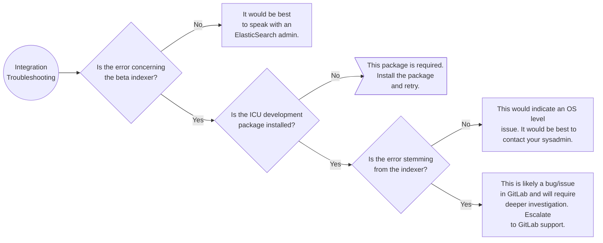
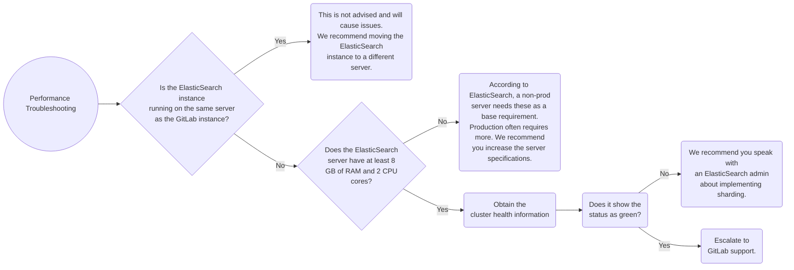

# Troubleshooting ElasticSearch

---

## Common Terminology

* **Lucene**
  * A full-text search library written in Java.
* **Near Realtime (NRT)**
  * A term to refer to the slight latency from the time to index a document to the time when it becomes searchable.
* **Cluster**
  * A collection of one or more nodes that work together to hold all the data, provide indexing, and provide search capabilities.
* **Node**
  * A single server that works as part of a cluster.
* **Index**
  * A collection of documents that have somewhat similiar characteristics.
* **Document**
  * A basic unit of information that can be indexed.
* **Shards**
  * Fully-functional and independent subdivisions of indices. Each shard is actuall a Lucene index.
* **Replicas**
  * Failover mechanisms that duplicate indices

## Flowcharts



### Search Results Troubleshooting Flowchart



### Indexing Troubleshooting Flowchart



### Integration Troubleshooting Flowchart



### Performance Troubleshooting Flowchart



## Troubleshooting Walkthrough

Most ElasticSearch troubleshooting can be broken down into 4 categories:

* [Troubleshooting Search Results](#troubleshooting-search-results)
* [Troubleshooting Indexing](#troubleshooting-indexing)
* [Troubleshooting Integration](#troubleshooting-integration)
* [Troubleshooting Performance](#troubleshooting-performance)

Generally speaking, if it does not fall into those 4 categories, it is either something GitLab support needs to look into or not a true ElasticSearch issue. Exercise caution, ElasticSearch is an easy scapegoat for OS level issues.

### Troubleshooting Search Results

Troubleshooting search result issues is rather straight forward on ElasticSearch (to a point). The first step tends to be wanting to confirm GitLab is using ElasticSearch for the search function. You would want to check via the admin panel (`Admin Area > Integrations`) to confirm the integration is enabled. From there, confirm searches utilize ElasticSearch by accessing the rails console (`sudo gitlab-rails console`) and running the following commands:

```rails
u = User.find_by_email('email_of_user_doing_search')
s = SearchService.new(u, {:search => 'search_term'})
pp s.search_objects.class.name
```

The ouput from the last command is the key here. If it shows `ActiveRecord::Relation`, it is **not** using ElasticSearch. On the other hand, if it shows `Kaminari::PaginatableArray`, **it is using ElasticSearch**.

| Not using ElasticSearch  | Using ElasticSearch          |
|--------------------------|------------------------------|
| `ActiveRecord::Relation` | `Kaminari::PaginatableArray` |

If all the settings look correct and it is still not using ElasticSearch for the search function, it is best to escalate to GitLab support. This could be a bug/issue.

Moving past that, it is best to attempt the same search using the [ElasticSearch Search API](https://www.elastic.co/guide/en/elasticsearch/reference/current/search-search.html) and compare the results from what you see in GitLab.

If the results sync up, then there is not a technical "issue" per se. Instead, it might be a problem with the ElasticSearch filters we are using. This can be complicated, so it is best to escalate to GitLab support to check these and guide you on the potential on whether or not a feature request is needed.

If the results do not match up, this would indicate a problem with the documents generated from the project. It is best to re-index that project and proceed with [Troubleshooting Indexing](#troubleshooting-indexing).

### Troubleshooting Indexing

Troubleshooting indexing issues can be tricky. It can pretty quickly go to either GitLab support or your ElasticSearch admin. The best place to start is to determine if the issue is with creating an empty index. If it is, you then need to check on the ElasticSearch side to determine if the `gitlab-production` (the name for the GitLab index) exists. If it does, you will want to manually delete it on the ElasticSearch side and attempt recreating it from the GitLab rake task `sudo gitlab-rake gitlab:elastic:create_empty_index`. If you still encounter issues, you will want to try creating an index manually on the ElasticSearch instance. The details of the index aren't important here, as we are wanting to test if indices can be made. If they cannot be made, you will need to speak with your ElasticSearch admin. If they can be made, you will want to escalate this to GitLab support.

If the issue is not with creating an empty index, the next step is to check for errors during the indexing projects. If errors do occur, they will either stem from the indexing on the GitLab side or within the ElasticSearch instance itself. If you do see errors on the GitLab side, you will want to rectify those. If they are not something you are familiar with, you will want to contact GitLab support for guidance. If you see errors on the ElasticSearch side, check [ElasticSearch integration > Troubleshooting](https://docs.gitlab.com/ee/integration/elasticsearch.html#troubleshooting) to see if the error is documented and has a fix. If not, it would be best to speak with your ElasticSearch admin.

If the indexing process does not present errors, you will want to check the status of the indexed projects. You can do this via the following rake tasks:

* [`sudo gitlab-rake gitlab:elastic:index_projects_status`](https://gitlab.com/gitlab-org/gitlab-ee/blob/master/ee/lib/tasks/gitlab/elastic.rake) (shows the overall status)
* [`sudo gitlab-rake gitlab:elastic:projects_not_indexed`](https://gitlab.com/gitlab-org/gitlab-ee/blob/master/ee/lib/tasks/gitlab/elastic.rake) (shows specific projects that are not indexed)

If everything is showing at 100%, it is best at this point to escalate to GitLab support. This could be a potential bug/issue. If you do see something not at 100%, you would want to attempt re-indexing that project. To do this, you can run the `sudo gitlab-rake gitlab:elastic:index_projects ID_FROM=xxx ID_TO=xxx` (replacing `xxx` with the project ID).

If re-indexing the project shows errors on the GitLab side, you will want to escalate those to GitLab support. If it shows ElasticSearch errors or doesn't present any errors at all, you will likely want to reach out to your ElasticSearch admin to check the instance.

### Troubleshooting Integration

Troubleshooting integration tends to be pretty straight forward, as there really isn't much to "integrate" here. If the error is not concerning the beta indexer, it is almost always an ElasticSearch side issue. This would mean you would want to reach out to your ElasticSearch admin regarding the error(s) you are seeing. If you are unsure here, it never hurts to reach out to GitLab support.

If the issue is with the beta indexer, the first thing to check is if the ICU development package is installed. This is a required package, so if not, make sure you install it.

Beoynd that, you will want to review the error. If it is specifically from the indexer, this could be a bug/issue and should be escalated to GitLab support. If it is an OS issue, you will want to reach out to your sysadmin.

### Troubleshooting Performance

Troubleshooting performance can be difficult on ElasticSearch. There is a ton of tuning that *can* be done, but the majority of this falls on shoulders of a skilled ElasticSearch administrator. Generally speaking, the quickest things to check for are:

* Is the ElasticSearch server running on the same node as GitLab?
  * If so, it should not be.
* Does the ElasticSearch server have enough RAM and CPU cores?
  * If not, it needs to.
* Is sharding being used currently?
  * If not, it should be.

Going into some more detail here, if ElasticSearch is running on the same server as GitLab, resource contention is **very** likely to occur. Ideally, ElasticSearch, which requires ample resources, should be running on its own server (maybe coupled with logstash and kibana).

When it comes to ElasticSearch, RAM is the key resource. ElasticSearch themselves recommend **at least** 8 GB of RAM for a non-production instance. If being used in production, this amount rockets up to 16 GB. The ideal "sweet spot" as per ElasticSearch is 64 GB of RAM. For things like CPU, ElasticSearch recommends at least 2 CPU cores, but ElasticSearch states common setups use up to 8 cores. For more details on server specs, check out [ElasticSearch's hardware guide](https://www.elastic.co/guide/en/elasticsearch/guide/current/hardware.html).

Beyond the obvious, sharding comes into play. Sharding is a core part of ElasticSearch. It allows for horizontal scaling of indices, which is super helpful when you are dealing with a large amount of data. With the way GitLab does indexing, there is a **huge** amount of documents being indexed. By utilizing sharding, you can speed up ElasticSearch's ability to locate data, since each shard is, in of itself, a Lucene index. If you are not using sharding, you are likely to hit issues when you start using ElasticSearch in a production environment. Keep in mind that an index with only one shard has **no scale factor** and will likely encounter issues when called upon with some frequency. If you need to know how many shards, it is best to read [ElasticSearch's documentation on capacity planning](https://www.elastic.co/guide/en/elasticsearch/guide/2.x/capacity-planning.html), as the answer is not straight-forward.

The easiest way to determine if sharding is in use is to check the output of [ElasticSearch Health API](https://www.elastic.co/guide/en/elasticsearch/reference/current/cluster-health.html). Red means the cluster is down, yellow means it is up with no sharding/replication, and green means it is healthy (up, sharding, replicating). For production use, it should always be green.

Beyond these steps, you get into some of the more complicated things to check, such as merges and caching. These can get complicated and it takes some time to learn them, so it is best to escalate/pair with an ElasticSearch expert if you need to dig further into these. Feel free to reach out to GitLab support, but this is likely to be something a skilled ElasticSearch admin has more experience with.

## Common Issues

In theory, all common issues should be documented via [ElasticSearch integration > Troubleshooting](https://docs.gitlab.com/ee/integration/elasticsearch.html#troubleshooting). If not, please feel free to update that page with issues you encounter and solutions to said issues.

## Replication

Setting up ElasticSearch isn't too bad, but it can be a bit finnicky and time consuming. The eastiest method is to spin up a docker container with the required version and bind ports 9200/9300 so it can be used. An example of running a docker container of ElasticSearch v7.2.0 would be:

```bash
docker pull docker.elastic.co/elasticsearch/elasticsearch:7.2.0
docker run -p 9200:9200 -p 9300:9300 -e "discovery.type=single-node" docker.elastic.co/elasticsearch/elasticsearch:7.2.0
```

From here, you can grab the IP of the docker container (use `docker inspect <container_id>`) and use `IP.add.re.ss:9200` to communicate with it. This is a quick method to test out ElasticSearch, but by no means is this a "production" solution.
