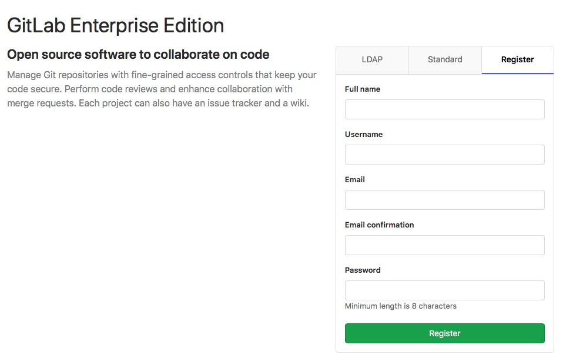
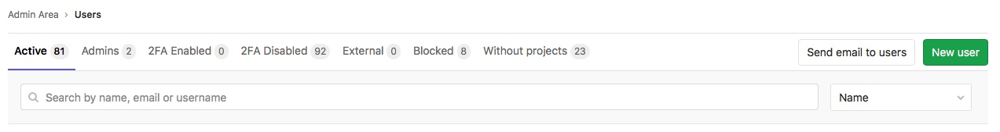
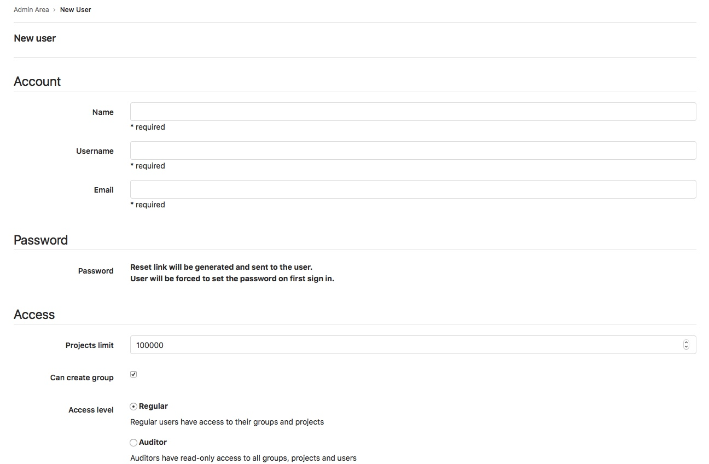

# User Creation **(CORE ONLY)**

Users can be created manually through the sign in page, the admin area, or automatically through user authentication integrations.

## Create users on sign in page

If you have [sign-up enabled](../user/admin_area/settings/sign_up_restrictions.md), users can manually create accounts using the Register tab on the sign in page.

## Create users in admin area

As an admin user, you can manually create users by going to the `/admin/users` page and selecting the New User button. You can also [create users through the API](../api/users.md) as an admin.

## Create users through integrations

Users will be automatically created upon first login with the [LDAP integration](auth/ldap.md). Users will also be created when first logging in via an [OmniAuth provider](../integration/omniauth.md) if the `allow_single_sign_on` setting is present.