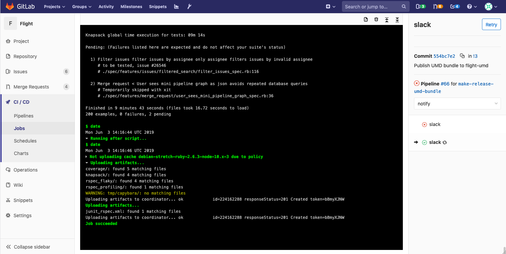

# Job
Job traces are sent by GitLab Runner while it’s processing a job. You can see traces in job pages, pipelines, email notifications, etc

### Collapsible sections
When the trace contains sections delimeters, the job log will be rendered with collapsible sections

