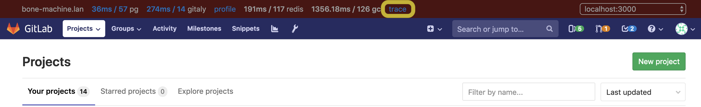

# Distributed Tracing

GitLab supports [distributed tracing](https://opentracing.io/docs/overview/what-is-tracing/) instrumentation.

>  Distributed tracing, also called distributed request tracing, is a method used to profile and monitor applications, especially those built using a microservices architecture. Distributed tracing helps pinpoint where failures occur and what causes poor performance.

<sup>From https://opentracing.io/docs/overview/what-is-tracing/</sup>

Distributed tracing is especially helpful in understanding the life-cycle of a request as it passes through the different components of the GitLab application. At present, Workhorse, Rails, Sidekiq and Gitaly support tracing instrumentation.

Distributed tracing adds minimal overhead when disabled, but imposes only small overhead when enabled and is designed to be run in any environment, including production environments. For this reason, it can be useful in diagnosing production issues, particularly performance problems.

## Enabling Distributed Tracing

GitLab uses the `GITLAB_TRACING` environment variable to configure distributed tracing. The same configuration is used for all components (eg Workhorse, Rails, etc).

When `GITLAB_TRACING` is not set, the application will not be instrumented, meaning that there is no overhead at all.

To enable `GITLAB_TRACING`, a valid _"connection-string"_-like value should be set, with the form:

```
GITLAB_TRACING=opentracing://<driver>?<param_name>=<param_value>&<param_name_2>=<param_value_2>
```

The parameters are as follows:

* `driver`: The driver. Currently GitLab supports `jaeger` for the [Jaeger](https://www.jaegertracing.io/) opentracing implementation. In future, other tracing implementations may also be supported.
* `param_name`, `param_value`: these are implementation specific configuration values. Note that they should be URL encoded.

## Using Jaeger in the GitLab Development Kit

The first tracing implementation that GitLab supports is Jaeger, and the [GitLab Development Kit](https://gitlab.com/gitlab-org/gitlab-development-kit/) supports distributed tracing with Jaeger [out-of-the-box](https://gitlab.com/gitlab-org/gitlab-development-kit/merge_requests/611).

The easiest way to access tracing from a GDK environment is through the [performance-bar](../administration/monitoring/performance/performance_bar.md). This can be done by typing `p` `b` in the browser to enable the bar.



Once the performance bar is enabled, click on the **Trace** link in the performance bar to open the Jaeger UI.

This will open the Jaeger search UI, defaulting to a query for the current Correlation-ID. Normally, this search should always return a single trace. Click on this will show the detail of the trace in a hierarchical time-line.


## Using Jaeger without the GitLab Developer Kit

Distributed Tracing can be enabled in non-GDK development environments as well as production or staging environments, for troubleshooting. Please note that at this time, this functionality is experimental, and not supported. Additionally, the configuration may change before it's officially supported in production environments.

Jaeger tracing can be enabled through a three-step process:

1. Start Jaeger
1. Configure the `GITLAB_TRACING` environment variable
1. Start the GitLab application
1. Open the Jaeger Search UI

Let's review each of these steps in more detail:

### 1. Start Jaeger

Jaeger has many configuration options, but is very easy to start in an "all-in-one" mode which uses memory for trace storage (and is therefore non-persistent). The main advantage of "all-in-one" mode being ease of use.

For more detailed configuration options, refer to the [Jaeger documentation](https://www.jaegertracing.io/docs/1.9/getting-started/).

#### Using Docker

If you have Docker available, the easier approach to running the Jaeger all-in-one is through Docker, using the following command:

```console
$ docker run \
  --rm \
  -e COLLECTOR_ZIPKIN_HTTP_PORT=9411  \
  -p 5775:5775/udp \
  -p 6831:6831/udp \
  -p 6832:6832/udp \
  -p 5778:5778 \
  -p 16686:16686 \
  -p 14268:14268 \
  -p 9411:9411 \
  jaegertracing/all-in-one:latest
```

#### Using the Jaeger process

Without Docker, the all-in-one process is still easy to setup.

1. Download the latest Jaeger release for your platform from [the releases page](https://github.com/jaegertracing/jaeger/releases)
1. Extract the archive and run the `bin/all-in-one` process.

This should start the process with the default listening ports.

### 2. Configure the `GITLAB_TRACING` environment variable

Once you have Jaeger running, you'll need to configure the `GITLAB_TRACING` variable with the appropriate connection string.

**TL;DR:** If you are running everything on the same host, use the following value:

```console
$ export GITLAB_TRACING="opentracing://jaeger?http_endpoint=http%3A%2F%2Flocalhost%3A14268%2Fapi%2Ftraces&sampler=const&sampler_param=1"
```

**Detailed explaination**

This connection string uses the Jaeger driver `opentracing://jaeger` with the following options:

| Name | Value | Description |
|------|-------|-------------|
| `http_endpoint` | `http://localhost:14268/api/traces` | Configures Jaeger to send trace information to the HTTP endpoint running on `http://localhost:14268/`. Alternatively, the `upd_endpoint` can be used. |
| `sampler` | `const` | Configures Jaeger to use the constant sampler (either on or off) |
| `sampler_param` | `1` | Configures the `const` sampler to sample _all_ traces. Using `0` would sample _no_ traces. |

**Other parameter values are also possible**

| Name | Example | Description |
|------|-------|-------------|
| `udp_endpoint` | `localhost:6831` | This is the default. Configures Jaeger to send trace information to the UDP listener on port `6831` using compact thrift protocol. Note that we've experienced some issues with the [Jaeger Client for Ruby](https://github.com/salemove/jaeger-client-ruby) when using this protocol. |
| `sampler` | `probabalistic` | Configures Jaeger to use a probabilistic random sampler. The rate of samples is configured by the `sampler_param` value. |
| `sampler_param` | `0.01` | Use a ratio of `0.01` to configure the `probabalistic` sampler to randomly sample _1%_ of traces. |

Note that the same `GITLAB_TRACING` value should to be configured in the environment variables for all GitLab processes, including Workhorse, Gitaly, Rails and Sidekiq.

### 3. Start the GitLab application

Once the `GITLAB_TRACING` environment variable is exported to all GitLab services, start the application.

When `GITLAB_TRACING` is configured properly, the application will log this on startup:

```
13:41:53 gitlab-workhorse.1      | 2019/02/12 13:41:53 Tracing enabled
...
13:41:54 gitaly.1                | 2019/02/12 13:41:54 Tracing enabled
...
```

If `GITLAB_TRACING` is not configured correctly, this will also be logged:

```
13:43:45 gitaly.1                | 2019/02/12 13:43:45 skipping tracing configuration step: tracer: unable to load driver mytracer
```

By default, GitLab ships with the Jaeger tracer, but other tracers can be included at compile time. Details of how this can be done are included in the [LabKit tracing documentation](https://godoc.org/gitlab.com/gitlab-org/labkit/tracing
)

If no log messages about tracing are emitted, the `GITLAB_TRACING` environment variable is likely not set.

### 4. Open the Jaeger Search UI

By default, the Jaeger search UI is available at http://localhost:16686/search.

Don't forget that you will need to generate traces by using the application before they appear in the Jaeger UI.


