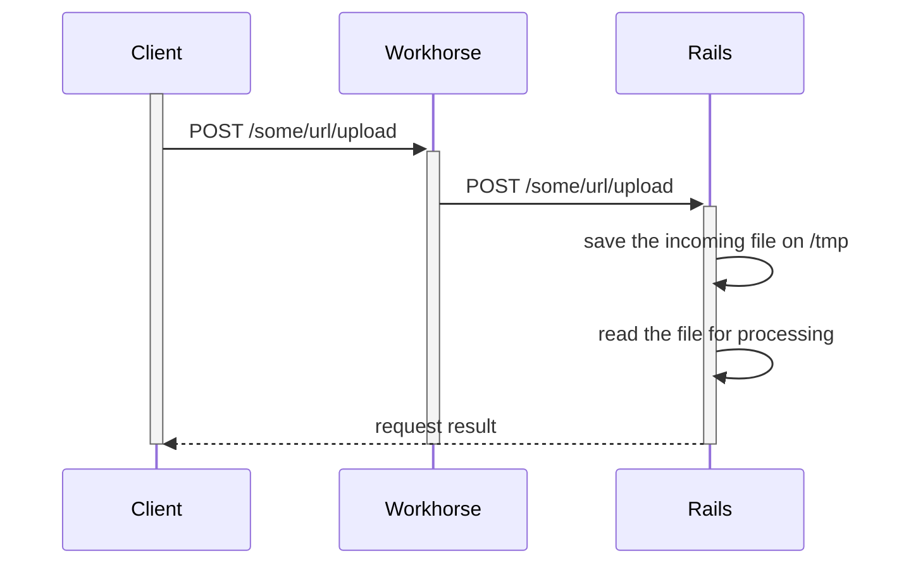
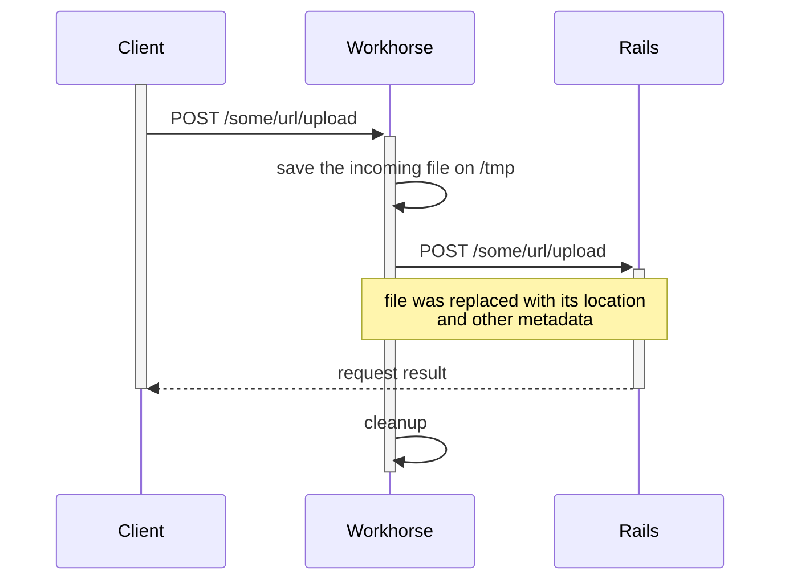
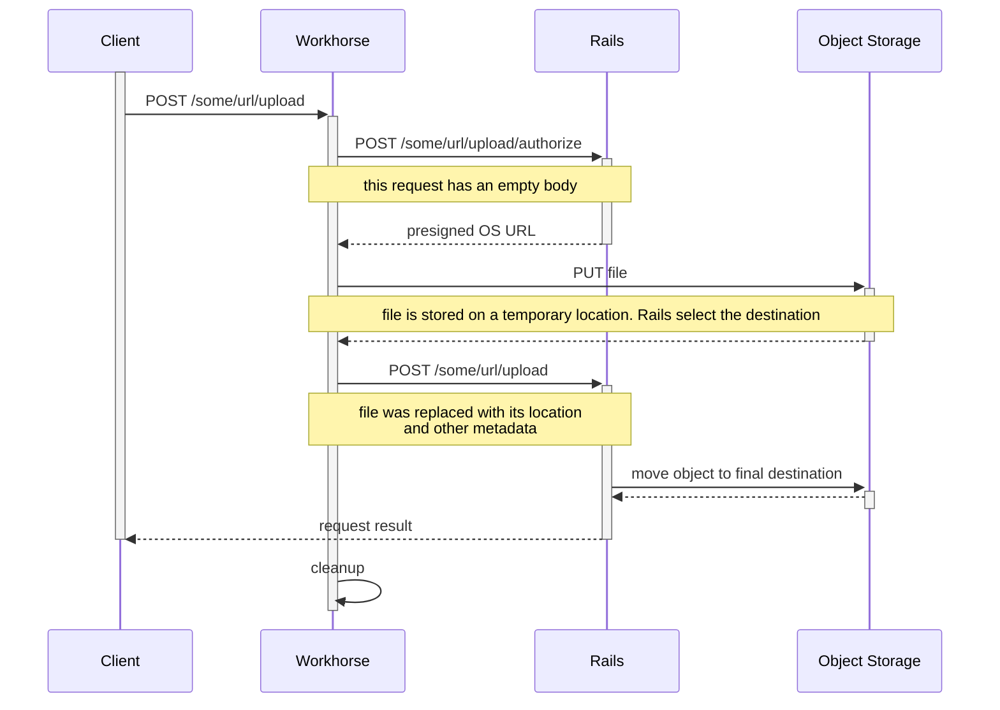

# Uploads development documentation

In workhorse we have special rules for handling uploads, instead of wasting a unicorn process on I/O operation, we perform the upload on a cheaper go-routine.
This process can also handle direct upload to object storage (There is <i class="fa fa-youtube-play youtube" aria-hidden="true"></i> [this not so small video](https://www.youtube.com/watch?v=GNMU4akwab4) that explain a bit of what happens in workhorse).

The problem is that each new feature may need also a workhorse MR to take advantage of this.

# Current status

In gitlab we support several uploads technologies and upload encodings. Details on the implementations are provided in the next paragraphs. Here follow a brief table of what we have now

| Feature                                  | technology                  | encoding  | issue                      |
|------------------------------------------|-----------------------------|-----------|----------------------------|
| git LFS                                  | Object Storage acceleration | body      |                            |
| CI artifacts                             | Object Storage acceleration | multipart |                            |
| Maven packages                           | Object Storage acceleration | body      |                            |
| Uploads                                  | Object Storage acceleration | multipart |                            |
| Avatars (user, group, project)           | disk acceleration           | multipart |                            |
| Instance aspect customization            | disk acceleration           | multipart |                            |
| uploads from a browser into a repository | disk acceleration           | multipart |                            |
| wiki attachments                         | rails                       | body      | gitlab-org/gitlab-ce#65167 |
| NPM packages                             | rails                       | JSON      | gitlab-org/gitlab-ee#13078 |
| GraphQL uploads                          | rails                       | multipart | gitlab-org/gitlab-ce#65163 |
| WEb IDE                                  | rails                       | JSON      | gitlab-org/gitlab-ce#65168 |
| project import from web interface        | disk acceleration           | multipart |                            |
| project import from API                  | rails                       | multipart | TODO                       |
| anything else under `/api`               | rails                       | ???       | TODO                       |

## Upload encodings

From the analysis, we found only 3 kinds of file encoding in our uploads.

1. :white_check_mark: *multipart*: `multipart/form-data` is the most common and we support it
1. :white_check_mark: *body*: some APIs uploads files as the whole request body. It's supported 
1. :red_circle: *JSON*: some JSON API uploads files as base64 encoded strings. This is not supported in workhorse - gitlab-workhorse#226

## Uploading technologies

GitLab supports 3 kinds of uploads, here follow a brief description with a sequence diagram for each upload. Diagrams are not meant to be exhaustive.

### Regular rails upload

This is the default kind of upload, and it's most expensive in terms of resources.

In this case, workhorse is unaware of files being uploaded and acts as a regular proxy.

### Workhorse disk acceleration

This kind of upload avoids wasting resources caused by handling uploads writes to `/tmp` in rails.

When workhorse finds files in a multipart MIME body it sends
a signed message via a request header. This message lists the names of
the multipart entries that workhorse filtered out of the
multipart structure and saved to tempfiles. Workhorse adds new entries
in the multipart structure with paths to the tempfiles.

### Workhorse object storage acceleration

This is the more advanced acceleration technique we have in place.

Workhorse asks rails for temporary pre-signed object storage URLs and directly uploads to object storage.

In this setup an extra rails route needs to be implemented in order to handle authorization.

**note:** this can fallback to _Workhorse disk acceleration_ when object storage is not enabled in the gitlab instance.

## How to select the proper level of acceleration.

I can think of 3 major use cases here:
1. **storage:** we are uploading for storing a file (i.e. artifacts, packages, discussion attachments). In this case Object Storage acceleration is the proper level as it's the less resource-intensive operation.
1. **in-controller/synchronous processing:** if we allow processing **small files** synchronously, using workhorse disk acceleration may speed up development.
1. **sidekiq/asynchronous processing:** Async processing should implement Object Storage acceleration, the reason being that it will support ~"Cloud Native" deployment out of the box. In the name of the iteration value, we could start with a disk-based acceleration but it will not work on ~"Cloud Native" and it will require NFS on a traditional multi-VM setup

