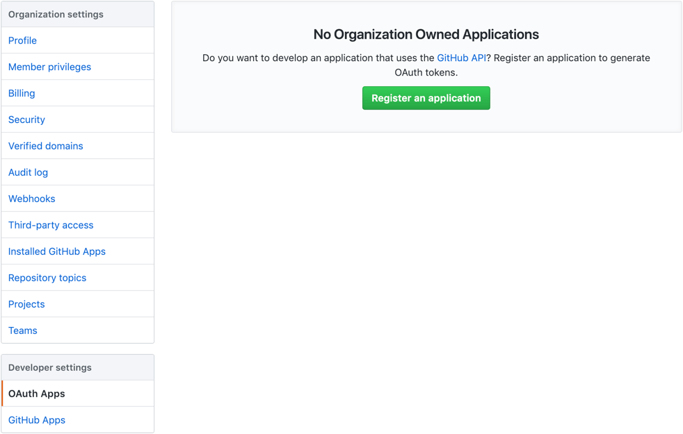
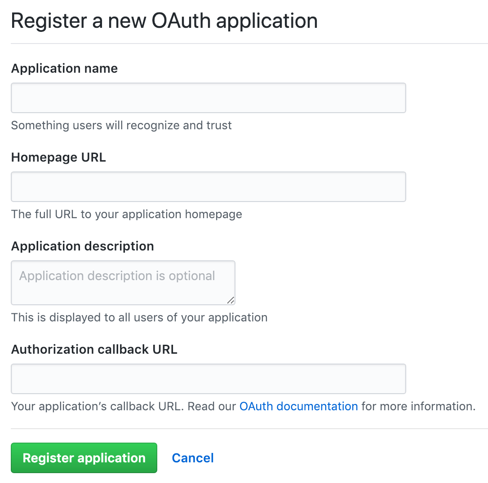
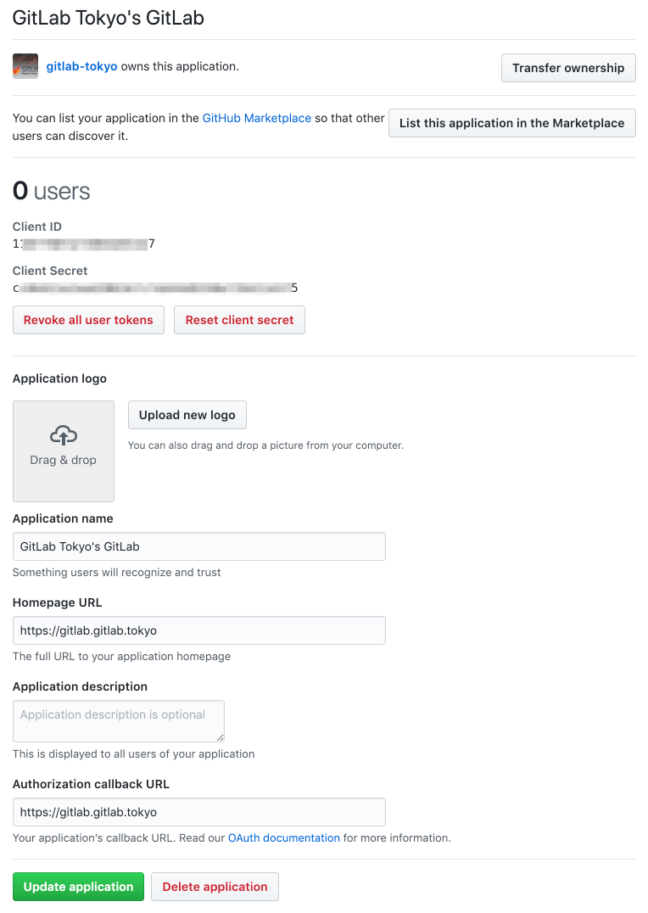

# Integrate your GitLab instance with GitHub

You can integrate your GitLab instance with GitHub.com as well as GitHub Enterprise to enable users to import projects from GitHub and/or to login to your GitLab instance with your GitHub account.

## Enabling GitHub OAuth

To enable GitHub OmniAuth provider, you must use GitHub's credentials for your GitLab instance.
To get the credentials (a pair of Client ID and Client Secret), you must register an application as an OAuth App on GitHub.

1. Sign in to GitHub.

1. Navigate to your individual user or organization settings, depending on how you want the application registered. It does not matter if the application is registered as an individual or an organization - that is entirely up to you.

   - For individual accounts, select **Developer settings** from the left menu, then select **OAuth Apps**.
   - For organization accounts, directly select **OAuth Apps** from the left menu.

1. Select **Register an application** (if you don't have any OAuth App) or **New OAuth App** (if you already have OAuth Apps).
   

1. Provide the required details.
   - Application name: This can be anything. Consider something like `<Organization>'s GitLab` or `<Your Name>'s GitLab` or something else descriptive.
   - Homepage URL: The URL of your GitLab installation. For example, `https://gitlab.example.com`.
   - Application description: Fill this in if you wish.
   - Authorization callback URL: `http(s)://${YOUR_DOMAIN}/users/auth`. Please make sure the port is included if your GitLab instance is not configured on default port.
   

   NOTE: Be sure to append `/users/auth` to the end of the callback URL
   to prevent a [OAuth2 convert
   redirect](http://tetraph.com/covert_redirect/) vulnerability.

1. Select **Register application**.

1. You should now see a pair of **Client ID** and **Client Secret** near the top right of the page (see screenshot).
   Keep this page open as you continue configuration.
   

1. On your GitLab server, open the configuration file.

   For Omnibus package:

   ```sh
   sudo editor /etc/gitlab/gitlab.rb
   ```

   For installations from source:

   ```sh
   cd /home/git/gitlab

   sudo -u git -H editor config/gitlab.yml
   ```

1. See [Initial OmniAuth Configuration](omniauth.md#initial-omniauth-configuration) for initial settings.

1. Add the provider configuration:

   For Omnibus package:

   For GitHub.com:

   ```ruby
   gitlab_rails['omniauth_providers'] = [
     {
       "name" => "github",
       "app_id" => "YOUR_APP_ID",
       "app_secret" => "YOUR_APP_SECRET",
       "args" => { "scope" => "user:email" }
     }
   ]
   ```

   For GitHub Enterprise:

   ```ruby
   gitlab_rails['omniauth_providers'] = [
     {
       "name" => "github",
       "app_id" => "YOUR_APP_ID",
       "app_secret" => "YOUR_APP_SECRET",
       "url" => "https://github.example.com/",
       "args" => { "scope" => "user:email" }
     }
   ]
   ```

   For installation from source:

   For GitHub.com:

   ```
   - { name: 'github', app_id: 'YOUR_APP_ID',
     app_secret: 'YOUR_APP_SECRET',
     args: { scope: 'user:email' } }
   ```

   For GitHub Enterprise:

   ```
   - { name: 'github', app_id: 'YOUR_APP_ID',
     app_secret: 'YOUR_APP_SECRET',
     url: "https://github.example.com/",
     args: { scope: 'user:email' } }
   ```

   __Replace `https://github.example.com/` with your GitHub URL.__

1. Change `YOUR_APP_ID` to the Client ID from the GitHub application page from step 6.

1. Change `YOUR_APP_SECRET` to the Client Secret from the GitHub application page from step 6.

1. Save the configuration file.

1. [Reconfigure GitLab][] or [restart GitLab][] for the changes to take effect if you
   installed GitLab via Omnibus or from source respectively.

On the sign in page there should now be a GitHub icon below the regular sign in form.
Click the icon to begin the authentication process. GitHub will ask the user to sign in and authorize the GitLab application.
If everything goes well the user will be returned to GitLab and will be signed in.

## GitHub Enterprise with self-signed Certificate

If you are attempting to import projects from GitHub Enterprise with a self-signed
certificate and the imports are failing, you will need to disable SSL verification.
It should be disabled by adding `verify_ssl` to `false` in the provider configuration
and changing the global Git `sslVerify` option to `false` in the GitLab server.

For Omnibus package:

```ruby
gitlab_rails['omniauth_providers'] = [
  {
    "name" => "github",
    "app_id" => "YOUR_APP_ID",
    "app_secret" => "YOUR_APP_SECRET",
    "url" => "https://github.example.com/",
    "verify_ssl" => false,
    "args" => { "scope" => "user:email" }
  }
]
```

You will also need to disable Git SSL verification on the server hosting GitLab.

```ruby
omnibus_gitconfig['system'] = { "http" => ["sslVerify = false"] }
```

For installation from source:

```
- { name: 'github', app_id: 'YOUR_APP_ID',
  app_secret: 'YOUR_APP_SECRET',
  url: "https://github.example.com/",
  verify_ssl: false,
  args: { scope: 'user:email' } }
```

You will also need to disable Git SSL verification on the server hosting GitLab.

```
$ git config --global http.sslVerify false
```

For the changes to take effect, [reconfigure GitLab] if you installed
via Omnibus, or [restart GitLab] if you installed from source.

[reconfigure GitLab]: ../administration/restart_gitlab.md#omnibus-gitlab-reconfigure
[restart GitLab]: ../administration/restart_gitlab.md#installations-from-source
