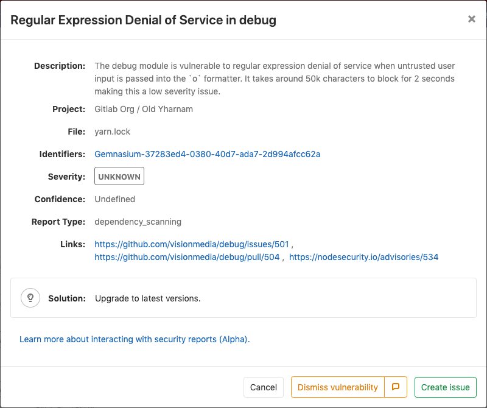
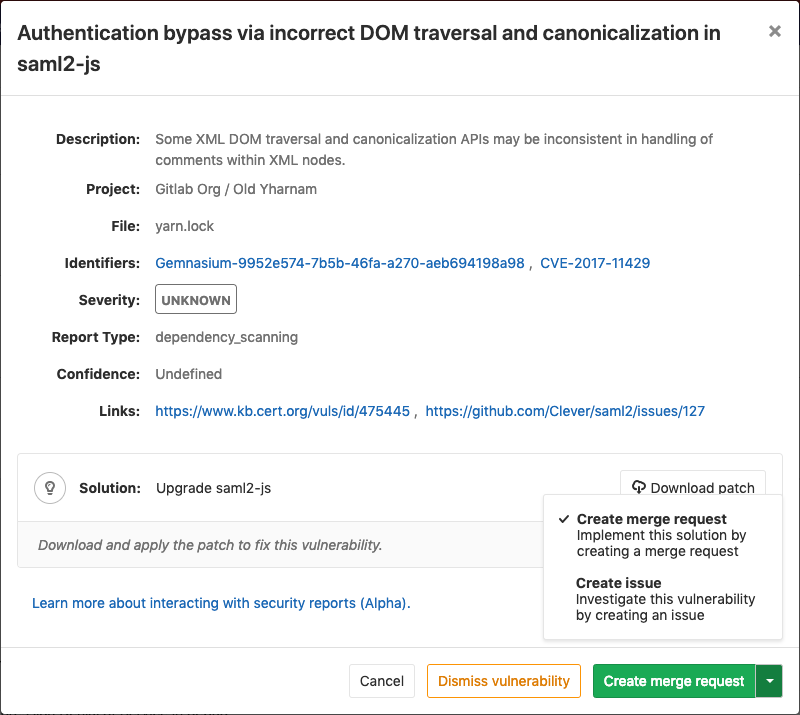

# GitLab Secure **[ULTIMATE]**

Check your application for security vulnerabilities that may lead to unauthorized access,
data leaks, and denial of services. GitLab will perform static and dynamic tests on the
code of your application, looking for known flaws and report them in the merge request
so you can fix them before merging. Security teams can use dashboards to get a
high-level view on projects and groups, and start remediation processes when needed.

## Security scanning tools

GitLab can scan and report any vulnerabilities found in your project.

| Secure scanning tools                                                        | Description                                                            |
|:-----------------------------------------------------------------------------|:-----------------------------------------------------------------------|
| [Container Scanning](container_scanning/index.md) **[ULTIMATE]**             | Scan Docker containers for known vulnerabilities.                      |
| [Dependency Scanning](dependency_scanning/index.md) **[ULTIMATE]**           | Analyze your dependencies for known vulnerabilities.                   |
| [Dynamic Application Security Testing (DAST)](dast/index.md) **[ULTIMATE]**  | Analyze running web applications for known vulnerabilities.            |
| [License Management](license_management/index.md) **[ULTIMATE]**             | Search your project's dependencies for their licenses.                 |
| [Security Dashboard](security_dashboard/index.md) **[ULTIMATE]**             | View vulnerabilities in all your projects and groups.                  |
| [Static Application Security Testing (SAST)](sast/index.md) **[ULTIMATE]**   | Analyze source code for known vulnerabilities.                         |

## Interacting with the vulnerabilities

> Introduced in [GitLab Ultimate](https://about.gitlab.com/pricing) 10.8.

CAUTION: **Warning:**
This feature is currently [Alpha](https://about.gitlab.com/handbook/product/#alpha-beta-ga) and while you can start using it, it may receive important changes in the future.

Each security vulnerability in the merge request report or the
[Security Dashboard](security_dashboard/index.md) is actionable. Clicking on an
entry, a detailed information will pop up with different possible options:

- [Dismiss vulnerability](#dismissing-a-vulnerability): Dismissing a vulnerability
  will place a <s>strikethrough</s> styling on it.
- [Create issue](#creating-an-issue-for-a-vulnerability): The new issue will
  have the title and description pre-populated with the information from the
  vulnerability report and will be created as [confidential](../project/issues/confidential_issues.md) by default.
- [Solution](#solutions-for-vulnerabilities): For some vulnerabilities
  ([Dependency Scanning](dependency_scanning/index.md) and [Container Scanning](container_scanning/index.md))
  a solution is provided for how to fix the vulnerability.

### Dismissing a vulnerability

You can dismiss vulnerabilities by clicking the **Dismiss vulnerability** button.
This will dismiss the vulnerability and re-render it to reflect its dismissed state.
If you wish to undo this dismissal, you can click the **Undo dismiss** button.

#### Adding a dismissal reason

> Introduced in [GitLab Ultimate](https://about.gitlab.com/pricing) 12.0.

When dismissing a vulnerability, it's often helpful to provide a reason for doing so.
If you press the comment button next to **Dismiss vulnerability** in the modal, a text box will appear, allowing you to add a comment with your dismissal.
This comment can not currently be edited or removed, but future versions will add this functionality.

### Creating an issue for a vulnerability

You can create an issue for a vulnerability by selecting the **Create issue**
button from within the vulnerability modal or using the action buttons to the right of
a vulnerability row when in the group security dashboard.

This will create a [confidential issue](../project/issues/confidential_issues.md)
on the project this vulnerability came from and pre-fill it with some useful
information taken from the vulnerability report. Once the issue is created, you
will be redirected to it so you can edit, assign, or comment on it.

Upon returning to the group security dashboard, you'll see that
the vulnerability will now have an associated issue next to the name.

### Solutions for vulnerabilities

> Introduced in [GitLab Ultimate](https://about.gitlab.com/pricing) 11.7.

CAUTION: **Warning:**
Automatic Patch creation is only available for a subset of
[Dependency Scanning](dependency_scanning/index.md). At the moment only Node.JS
projects managed with yarn are supported.

Some vulnerabilities can be fixed by applying the solution that GitLab
automatically generates.

#### Manually applying the suggested patch

Some vulnerabilities can be fixed by applying a patch that is automatically
generated by GitLab. To apply the fix:

1. Click on the vulnerability.
1. Download and review the patch file `remediation.patch`.
2. Ensure your local project has the same commit checked out that was used to generate the patch.
3. Run `git apply remediation.patch`.
4. Verify and commit the changes to your branch.

#### Creating a merge request from a vulnerability

> [Introduced](https://gitlab.com/gitlab-org/gitlab-ee/issues/9224) in
  [GitLab Ultimate](https://about.gitlab.com/pricing) 11.9.

In certain cases, GitLab will allow you to create a merge request that will
automatically remediate the vulnerability. Any vulnerability that has a
[solution](#solutions-for-vulnerabilities) can have a merge request created to
automatically solve the issue.

If this action is available there will be a **Create merge request** button in the vulnerability modal.
Clicking on this button will create a merge request to apply the solution onto the source branch.

