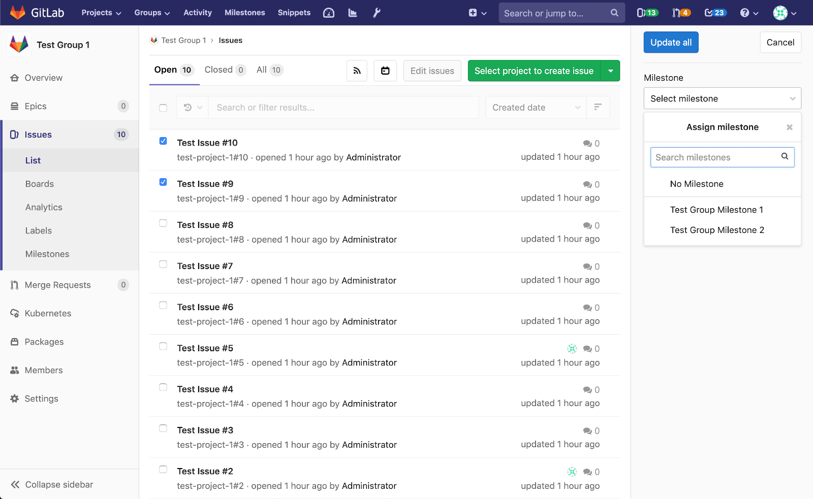

# Bulk editing issue milestones **[PREMIUM]**

> Introduced in [GitLab Ultimate][ee] 12.1.

> **Notes:**
>
> - A permission level of `Reporter` or higher is required in order to manage
>   issues.

Milestones can be updated simultaneously across multiple issues by using the bulk editing feature.

To bulk update group issue milestones, navigate to their respective lists and
click **Edit issues** available in the tab bar. This will open a sidebar on the right-hand
side of your screen where an editable field for milestones will be displayed.
Checkboxes will also appear to the left-hand side of each issue for you to select the items you want
to update.

Once you have selected all relevant items, choose the appropriate milestone from the sidebar
and click **Update all** to apply your changes.
