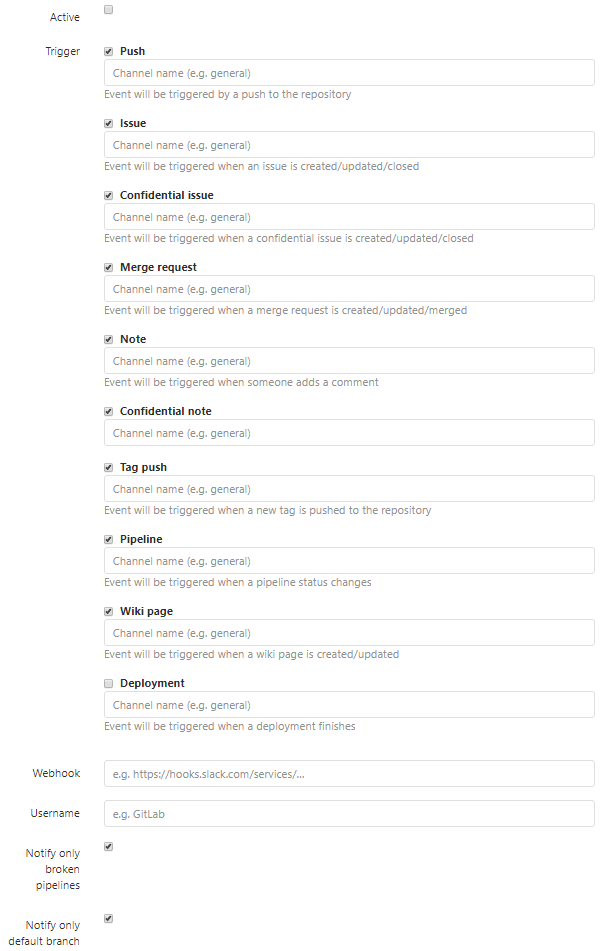

# Slack Notifications Service

The Slack Notifications Service allows your GitLab project to send events (e.g. issue created) to your existing Slack team as notifications. This requires configurations in both Slack and GitLab.

> Note: You can also use Slack slash commands to control GitLab inside Slack. This is the separately configured [Slack slash commands](slack_slash_commands.md).

## Slack Configuration

1. Sign in to your Slack team and [start a new Incoming WebHooks configuration](https://my.slack.com/services/new/incoming-webhook/).
1. Select the Slack channel where notifications will be sent to by default. Click the **Add Incoming WebHooks integration** button to add the configuration.
1. Copy the **Webhook URL**, which we'll use later in the GitLab configuration.

## GitLab Configuration

1. Navigate to the [Integrations page](project_services.md#accessing-the-project-services) in your project's settings, i.e. **Project > Settings > Integrations**.
1. Select the **Slack notifications** project service to configure it.
1. Check the **Active** checkbox to turn on the service.
1. Check the checkboxes corresponding to the GitLab events you want to send to Slack as a notification.
1. For each event, optionally enter the Slack channel where you want to send the event. (Do _not_ include the `#` symbol.) If left empty, the event will be sent to the default channel that you configured in the Slack Configuration step.
1. Paste the **Webhook URL** that you copied from the Slack Configuration step.
1. Optionally customize the Slack bot username that will be sending the notifications.
1. Configure the remaining options and click `Save changes`.

Your Slack team will now start receiving GitLab event notifications as configured.



## Troubleshooting

If you're having trouble with the Slack integration not working, then start by
searching through the [Sidekiq logs](https://docs.gitlab.com/ee/administration/logs.html#sidekiqlog)
for errors relating to your Slack service.

### Something went wrong on our end

This is a generic error shown in the GitLab UI and doesn't mean much by itself.
You'll need to look in the logs to find an error message and keep troubleshooting
from there.

### `certificate verify failed`

You may see an entry similar to the following in your Sidekiq log:

```text
2019-01-10_13:22:08.42572 2019-01-10T13:22:08.425Z 6877 TID-abcdefg ProjectServiceWorker JID-3bade5fb3dd47a85db6d78c5 ERROR: {:class=>"ProjectServiceWorker", :service_class=>"SlackService", :message=>"SSL_connect returned=1 errno=0 state=error: certificate verify failed"}
```

This is probably a problem either with GitLab communicating with Slack, or GitLab
communicating with itself. The former is less likely since Slack's security certificates
should _hopefully_ always be trusted. We can establish which we're dealing with by using
the below test script.

```ruby
#!/opt/gitlab/embedded/bin/ruby
# the shebang should be changed if you're not using Omnibus GitLab
require 'openssl'
require 'net/http'

puts "testing Slack"
# replace <SLACK URL> with your actual Slack URL
Net::HTTP.get(URI('https://<SLACK URL>'))

puts "testing GitLab"
# replace <GITLAB URL> with your actual GitLab URL
Net::HTTP.get(URI('https://<GITLAB URL>'))
```

If it's an issue with GitLab not trusting HTTPS connections to itself, then you may simply
need to [add your certificate to GitLab's trusted certificates](https://docs.gitlab.com/omnibus/settings/ssl.html#install-custom-public-certificates).

If it's an issue with GitLab not trusting connections to Slack, then the GitLab
OpenSSL trust store probably got messed up somehow. Typically this is from overriding
the trust store with `gitlab_rails['env'] = {"SSL_CERT_FILE" => "/path/to/file.pem"}`
or by accidentally modifying the default CA bundle `/opt/gitlab/embedded/ssl/certs/cacert.pem`.