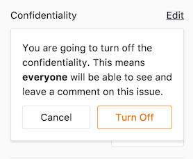
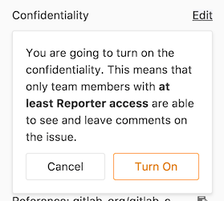
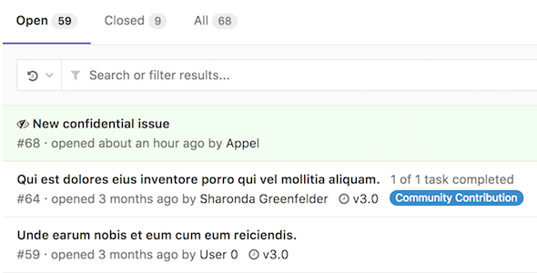
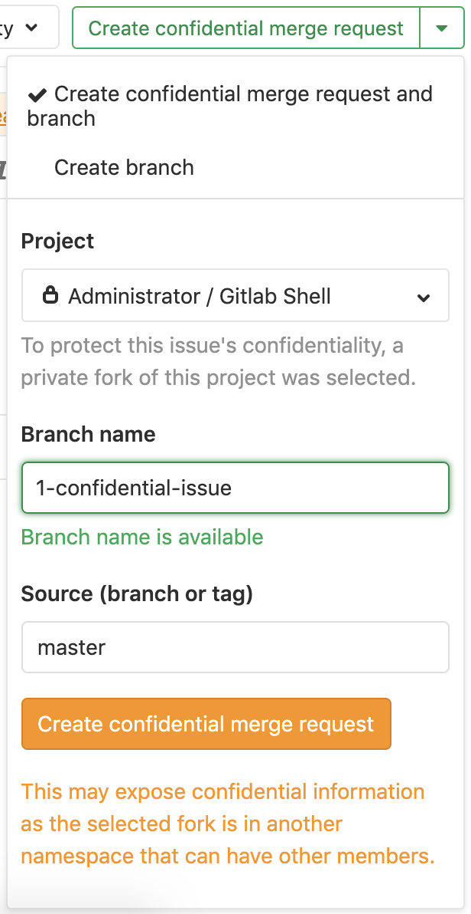
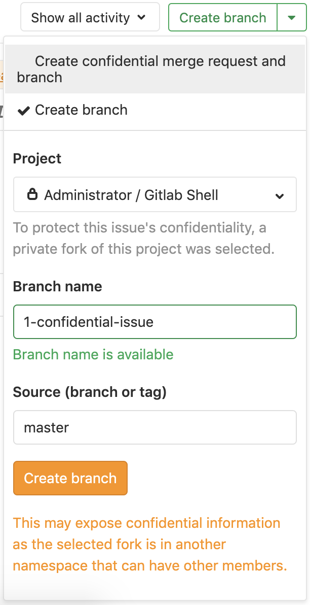

# Confidential issues

> [Introduced](https://gitlab.com/gitlab-org/gitlab-ce/merge_requests/3282) in GitLab 8.6.

Confidential issues are issues visible only to members of a project with
[sufficient permissions](#permissions-and-access-to-confidential-issues).
Confidential issues can be used by open source projects and companies alike to
keep security vulnerabilities private or prevent surprises from leaking out.

## Making an issue confidential

You can make an issue confidential during issue creation or by editing
an existing one.

When you create a new issue, a checkbox right below the text area is available
to mark the issue as confidential. Check that box and hit the **Submit issue**
button to create the issue. For existing issues, edit them, check the
confidential checkbox and hit **Save changes**.

## Modifying issue confidentiality

There are two ways to change an issue's confidentiality.

The first way is to edit the issue and mark/unmark the confidential checkbox.
Once you save the issue, it will change the confidentiality of the issue.

The second way is to locate the Confidentiality section in the sidebar and click
**Edit**. A popup should appear and give you the option to turn on or turn off confidentiality.

| Turn off confidentiality | Turn on confidentiality |
| :-----------: | :----------: |
|  |  |

Every change from regular to confidential and vice versa, is indicated by a
system note in the issue's comments.

## Indications of a confidential issue

>**Note:** If you don't have [enough permissions](#permissions-and-access-to-confidential-issues),
you won't be able to see the confidential issues at all.

There are a few things that visually separate a confidential issue from a
regular one. In the issues index page view, you can see the eye-slash icon
next to the issues that are marked as confidential.

---

Likewise, while inside the issue, you can see the eye-slash icon right next to
the issue number, but there is also an indicator in the comment area that the
issue you are commenting on is confidential.

There is also an indicator on the sidebar denoting confidentiality.

| Confidential issue | Not confidential issue |
| :-----------: | :----------: |
|  |  |

## Permissions and access to confidential issues

There are two kinds of level access for confidential issues. The general rule
is that confidential issues are visible only to members of a project with at
least [Reporter access](../../permissions.md#project-members-permissions). However, a guest user can also create
confidential issues, but can only view the ones that they created themselves.

Confidential issues are also hidden in search results for unprivileged users.
For example, here's what a user with Maintainer and Guest access sees in the
project's search results respectively.

| Maintainer access | Guest access |
| :-----------: | :----------: |
|  |  |

## Resolving confidential issue in a private fork

> [Introduced](https://gitlab.com/gitlab-org/gitlab-ce/issues/58583) in GitLab 12.1.

To ensure that confidential information in an issue won't be leaked (e.g. a security
issue), we allow creating a confidential merge request in a private fork.

On a confidential issue, a **Create confidential merge request** is available.
Clicking on it will open a dropdown where you can choose to **Create confidential
merge request and branch** or **Create branch**.

| Create confidential merge request | Create branch |
| :-------------------------------: | :-----------: |
|  |  |

The **Project** dropdown includes the list of private forks the user is a member
of as at least a Developer and merge requests are enabled.

Whenever the **Branch name** and **Source (branch or tag)** fields change, the
availability of the target or source branch will be checked. Both branches should
be available in the private fork selected.

Clicking the **Create confidential merge request** will create the branch and
merge request in the private fork. While clicking **Create branch** will only
create the branch.

Once the branch is created in the private fork, developer can now push code to
that branch to fix the confidential issue.
