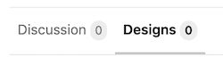

# Design Management **[PREMIUM]**

> [Introduced](https://gitlab.com/groups/gitlab-org/-/epics/660) in GitLab 12.1.

CAUTION: **Warning:**
This an __alpha__ feature and is subject to change at any time without
prior notice.

## Overview

Design Management allows people to upload a set of images to an issue.

## Requirements

Design Management requires [Large File Storage (LFS)](https://docs.gitlab.com/ee/workflow/lfs/manage_large_binaries_with_git_lfs.html) to be enabled.

- LFS is enabled for gitlab.com
- Self-managed GitLab instances should [enable LFS globally](https://docs.gitlab.com/ee/workflow/lfs/lfs_administration.html)
- LFS must be enabled within the project settings (this will default to enabled when LFS is enabled globally)

## Viewing designs

Navigate to the Design Management page from any issue by clicking the _Designs_ tab:

## Adding designs

To upload design images, click the _Upload Designs_ button and select the images you would like to upload.

Designs with the same filename as an existing uploaded design will create a new version of the design.

Click an image in the design board to enlarge it.
