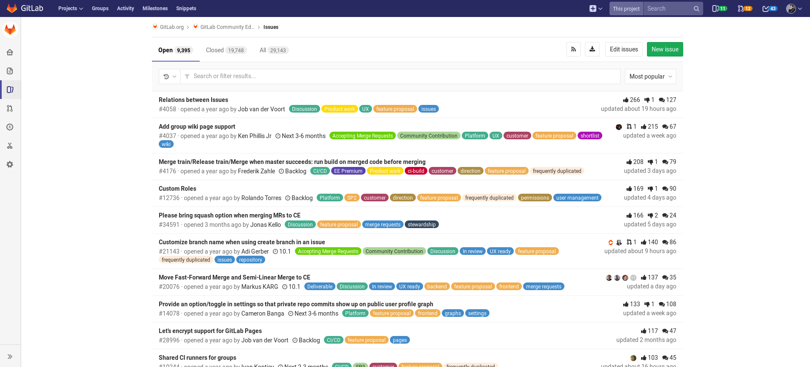

# Issues

The GitLab Issue Tracker is an advanced and complete tool
for tracking the evolution of a new idea or the process
of solving a problem.

It allows you, your team, and your collaborators to share
and discuss proposals before and while implementing them.

GitLab Issues and the GitLab Issue Tracker are available in all
[GitLab Products](https://about.gitlab.com/pricing/) as
part of the [GitLab Workflow](https://about.gitlab.com/2016/10/25/gitlab-workflow-an-overview/).

## Use cases

Issues can have endless applications. Just to exemplify, these are
some cases for which creating issues are most used:

- Discussing the implementation of a new idea
- Submitting feature proposals
- Asking questions
- Reporting bugs and malfunction
- Obtaining support
- Elaborating new code implementations

See also the blog post "[Always start a discussion with an issue](https://about.gitlab.com/2016/03/03/start-with-an-issue/)".

### Keep private things private

For instance, let's assume you have a public project but want to start a discussion on something
you don't want to be public. With [Confidential Issues](#confidential-issues),
you can discuss private matters among the project members, and still keep
your project public, open to collaboration.

### Streamline collaboration

With [Multiple Assignees for Issues](https://docs.gitlab.com/ee/user/project/issues/multiple_assignees_for_issues.html),
available in [GitLab Starter](https://about.gitlab.com/pricing/)
you can streamline collaboration and allow shared responsibilities to be clearly displayed.
All assignees are shown across your workflows and receive notifications (as they
would as single assignees), simplifying communication and ownership.

### Consistent collaboration

Create [issue templates](#issue-templates) to make collaboration consistent and
containing all information you need. For example, you can create a template
for feature proposals and another one for bug reports.

## Issue Tracker

The Issue Tracker is the collection of opened and closed issues created in a project.
It is available for all projects, from the moment the project is created.

Find the issue tracker by navigating to your **Project's homepage** > **Issues**.

### Issues per project

When you access your project's issues, GitLab will present them in a list,
and you can use the tabs available to quickly filter by open and closed issues.

You can also [search and filter](../../search/index.md#issues-and-merge-requests-per-project) the results more deeply with GitLab's search capacities.

### Issues per group

View issues in all projects in the group, including all projects of all descendant subgroups of the group. Navigate to **Group > Issues** to view these issues. This view also has the open and closed issues tabs.

## GitLab Issues Functionalities

The image bellow illustrates how an issue looks like:

Learn more about it on the [GitLab Issues Functionalities documentation](issues_functionalities.md).

## New issue

Read through the [documentation on creating issues](create_new_issue.md).

## Closing issues

Learn distinct ways to [close issues](closing_issues.md) in GitLab.

## Moving issues

Read through the [documentation on moving issues](moving_issues.md).

## Deleting issues

Read through the [documentation on deleting issues](deleting_issues.md)

## Create a merge request from an issue

Learn more about it on the [GitLab Issues Functionalities documentation](issues_functionalities.md#18-new-merge-request).

## Search for an issue

Learn how to [find an issue](../../search/index.md) by searching for and filtering them.

## Advanced features

### Confidential Issues

Whenever you want to keep the discussion presented in a
issue within your team only, you can make that
[issue confidential](confidential_issues.md). Even if your project
is public, that issue will be preserved. The browser will
respond with a 404 error whenever someone who is not a project
member with at least [Reporter level](../../permissions.md#project) tries to
access that issue's URL.

Learn more about them on the [confidential issues documentation](confidential_issues.md).

### Issue templates

Create templates for every new issue. They will be available from
the dropdown menu **Choose a template** when you create a new issue:

Learn more about them on the [issue templates documentation](../../project/description_templates.md#creating-issue-templates).

### Crosslinking issues

Learn more about [crosslinking](crosslinking_issues.md) issues and merge requests.

### Issue Board

The [GitLab Issue Board](https://about.gitlab.com/features/issueboard/) is a way to
enhance your workflow by organizing and prioritizing issues in GitLab.

Find GitLab Issue Boards by navigating to your **Project's Dashboard** > **Issues** > **Board**.

Read through the documentation for [Issue Boards](../issue_board.md)
to find out more about this feature.

With [GitLab Starter](https://about.gitlab.com/pricing/), you can also
create various boards per project with [Multiple Issue Boards](https://docs.gitlab.com/ee/user/project/issue_board.html#multiple-issue-boards).

### External Issue Tracker

Alternatively to GitLab's built-in Issue Tracker, you can also use an [external
tracker](../../../integration/external-issue-tracker.md) such as Jira, Redmine,
or Bugzilla.

### Issue's API

Read through the [API documentation](../../../api/issues.md).

### Bulk editing issues

Find out about [bulk editing issues](../../project/bulk_editing.md).

### Similar issues

Find out about [similar issues](similar_issues.md).
