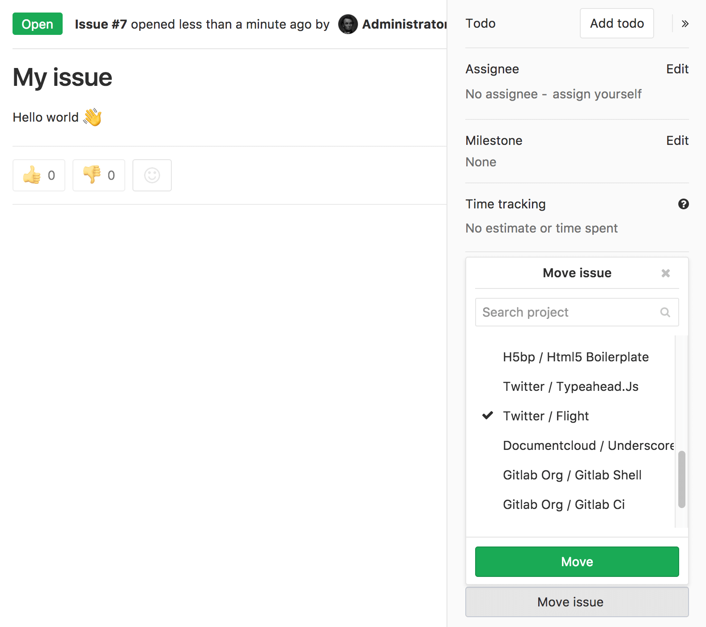

# Moving Issues

Please read through the [GitLab Issue Documentation](index.md) for an overview on GitLab Issues.

Moving an issue will close it and duplicate it on the specified project.
There will also be a system note added to both issues indicating where it came from or went to.

You can move an issue with the "Move issue" button at the bottom of the right-sidebar when viewing the issue.



## Moving Issues in Bulk

You can also bulk move all the issues from one project to another in the rails console. The below script will move all the issues from one project to another that are not in status **closed**.

To access rails console run `sudo gitlab-rails console` on the GitLab server and run the below script. Please be sure to change **project**, **admin_user** and **target_project** to your values.

```
project = Project.find_by_full_path('full path of the project where issues are moved from')
issues = project.issues
admin_user = User.find_by_username('username of admin user') # make sure user has permissions to move the issues
target_project = Project.find_by_full_path('full path of target project where issues moved to')

issues.each do |issue|
   if issue.state != "closed" && issue.moved_to.nil?
      Issues::MoveService.new(project, admin_user).execute(issue, target_project)
   else
      puts "issue with id: #{issue.id} and title: #{issue.title} was not moved"
   end
end; nil

``` 
{: .language-ruby}